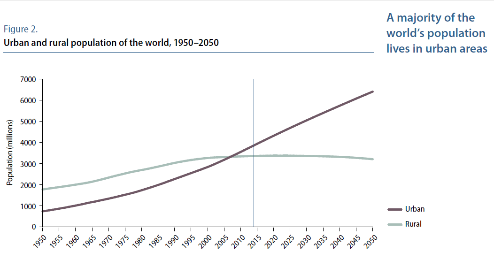
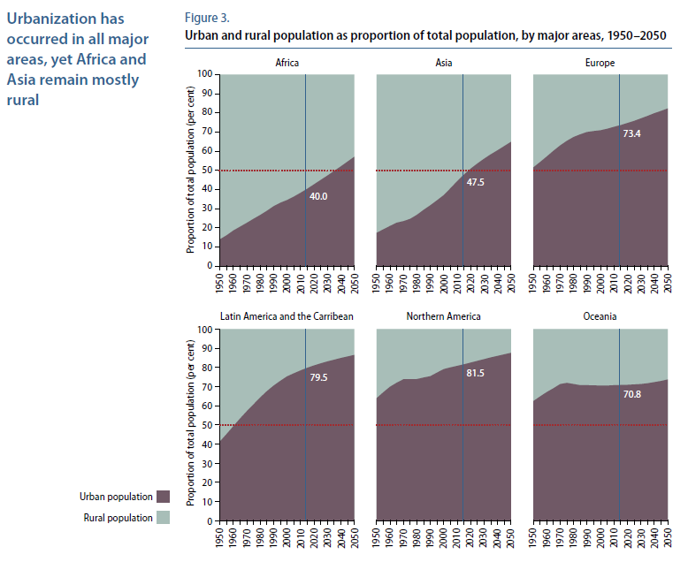
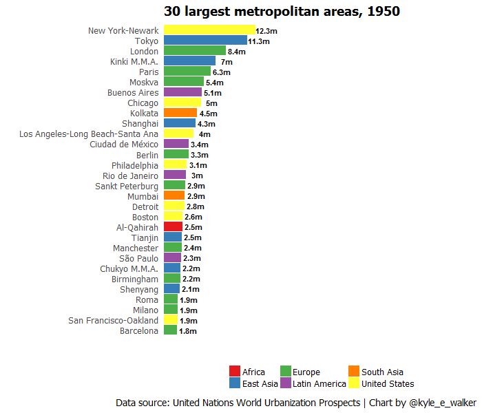
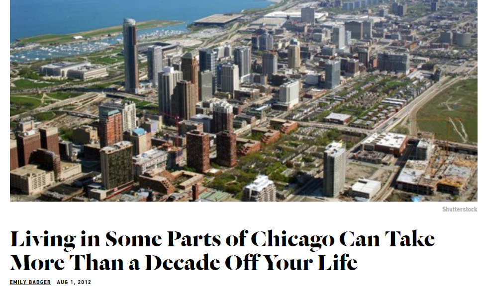
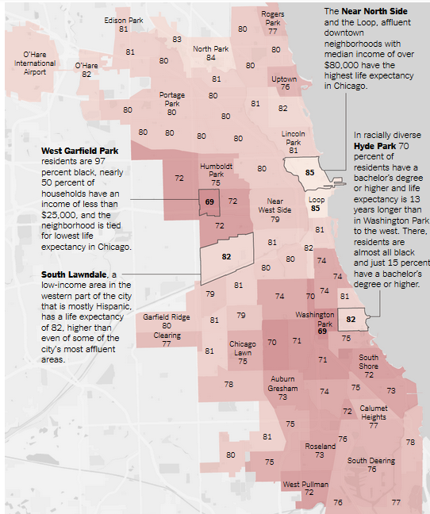
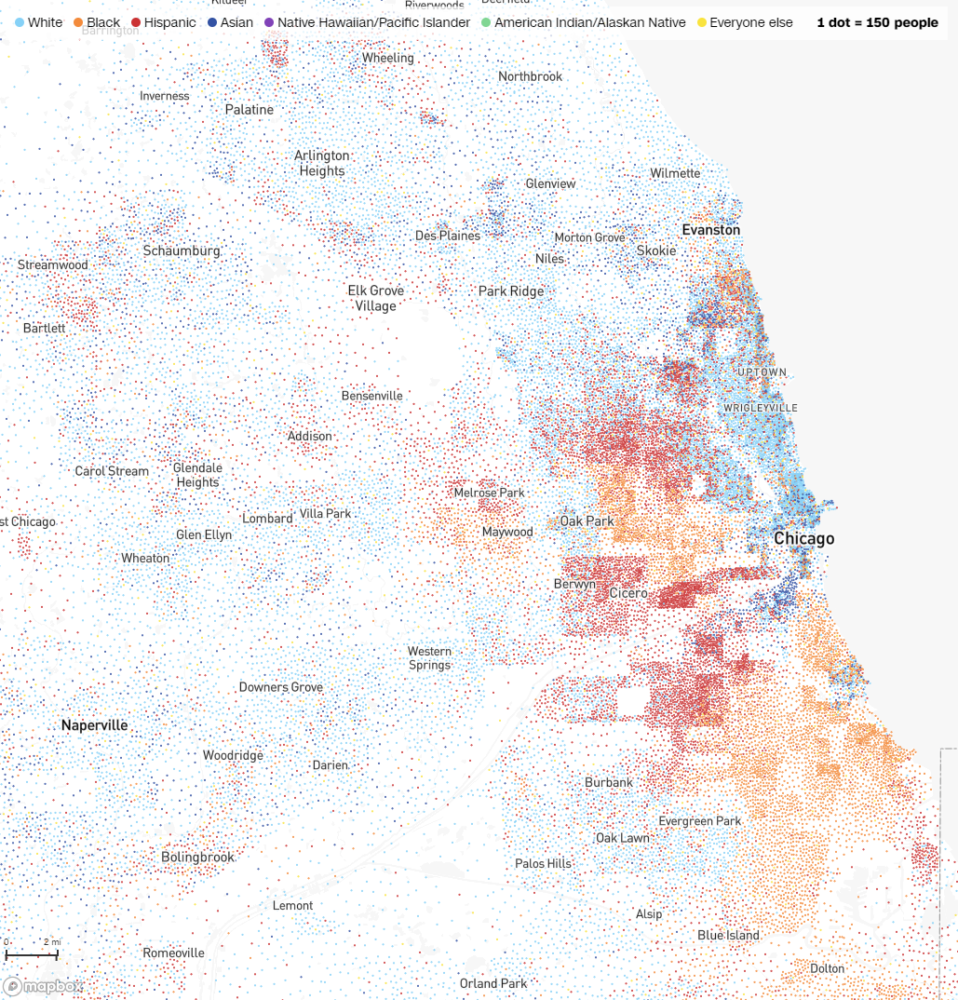
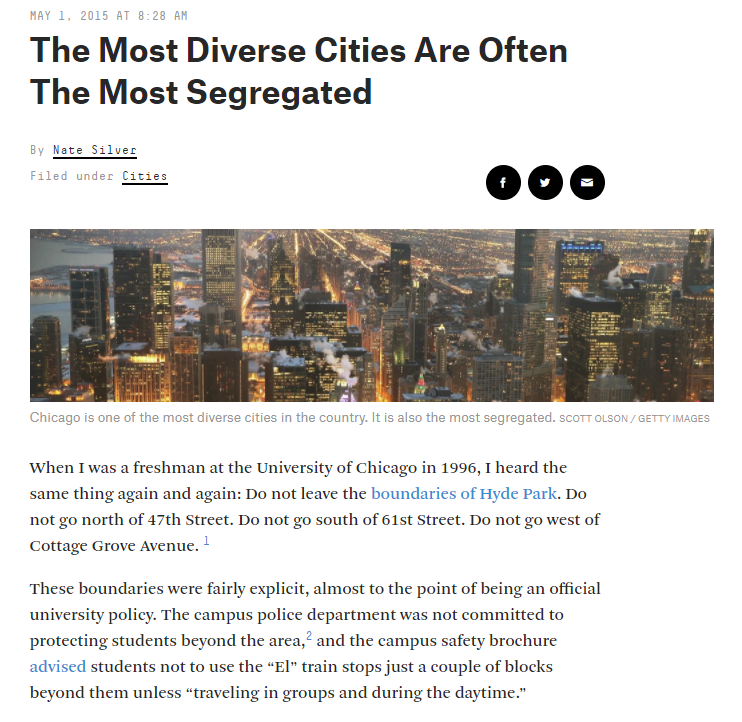

```{r setup, include=FALSE}
options(htmltools.dir.version = FALSE)
```

## Global urbanization

<iframe width="560" height="315" src="https://www.youtube.com/embed/cW_cCaybHL8" title="YouTube video player" frameborder="0" allow="accelerometer; autoplay; clipboard-write; encrypted-media; gyroscope; picture-in-picture; web-share" allowfullscreen></iframe>

---
class: center, middle, inverse

## Why do humans live in cities?  

---

## Recent urbanization



.footnote[Source: UN Population Prospects, the 2014 revision]

---

## Recent urbanization by region



.footnote[Source: UN Population Prospects, the 2014 revision]

---

## The growth of global cities

[World City Populations 1950-2035 (Duncan Smith/UCL)](http://luminocity3d.org/WorldCity/#3/12.00/10.00)

---

## World's largest cities over time



---
class: middle, inverse, center

# What is a city? 

---

## Is this a city?  


.footnote[Source: [The Telegraph](http://www.telegraph.co.uk/culture/culturepicturegalleries/9909936/Roman-ruins-in-Libya-aerial-photographs-by-Jason-Hawkes.html)]

---

## Is this a city?  

<iframe src="https://www.google.com/maps/embed?pb=!4v1516215647669!6m8!1m7!1soDdK_pFE646ZKfZGjUFcPg!2m2!1d30.02242488592553!2d-100.2084943248186!3f191.35369848575675!4f5.394188047962146!5f0.7820865974627469" width="800" height="500" frameborder="0" style="border:0" allowfullscreen></iframe>

---

## Is this a city?  


.footnote[Source: [DallasNews.com](https://www.dallasnews.com/news/news/2014/05/21/suburbs-near-dallas-among-fastest-growing-cities-in-u.s.)]

---

## Urban definitions

United Nations (https://esa.un.org/unpd/wup/): 

> _There is no common global definition of what constitutes an urban settlement... The criteria for classifying
an area as urban may be based on one or a combination of characteristics, such as: a
minimum population threshold; population density; proportion employed in non-agricultural
sectors; the presence of infrastructure such as paved roads, electricity, piped water or
sewers; and the presence of education or health services._

US Census: _urban areas_ and _urban clusters_

---

## Urban definitions

Lewis Mumford, "What is a City?" (1937)

> _The city in its complete sense, then, is a geographic plexus, an economic organization, an institutional process, a theater of social action, and an aesthetic symbol of collective unity._

---
class: middle, center, inverse

# How do we study cities?  

---

## Tools of urban studies

* Urban & social theory

* Mapping and geographic information science

* Quantitative analysis

* Qualitative methods

---

## Example: Chicago



.footnote[Source: The Atlantic/CityLab]

---

## Life expectancy in Chicago



.footnote[Source: The New York Times]

---

## Income inequality in Chicago

<iframe src="img/il_income.html" height = "500" width = "800" frameborder="0" scrolling="no"></iframe>

---

## Racial segregation in Chicago



.footnote[Source: https://www.cnn.com/interactive/2021/us/census-race-ethnicity-map/]

---

## Scale, demographics, and perceptions of place



.footnote[Source: [FiveThirtyEight](https://fivethirtyeight.com/features/the-most-diverse-cities-are-often-the-most-segregated/)]

---

## Lending discrimination in Chicago


.footnote[Source: [Mapping Inequality project, University of Richmond](https://dsl.richmond.edu/panorama/redlining/#loc=11/41.8609/-87.6774&opacity=0.8&city=chicago-il)]

---

## Qualitative methods

About Washington Park in Chicago, from 1940 HOLC rating documents: 

> _This venture has the realtors guessing as to what the ultimate result will be when so many of this race are drawn into this section from the already negro-blighted district; particularly its effect on the section east and south of Cottage Grove, and to park and water frontage on Lake Michigan. Already Washington Park at the south, a very fine park, has been almost completely monopolized by the colored race._

.footnote[Source: [Mapping Inequality Project](https://dsl.richmond.edu/panorama/redlining/#loc=11/41.8609/-87.6774&opacity=0.8&city=chicago-il&area=D74&sort=295,45)]

---
class: middle, center, inverse

# Next up: Chicago...


<style>

h1, h2, h3 {
  color: #386890; 
}

a {
  color: #90b4d2; 
}

.inverse {
  background-color: #386890; 

}
</style>


