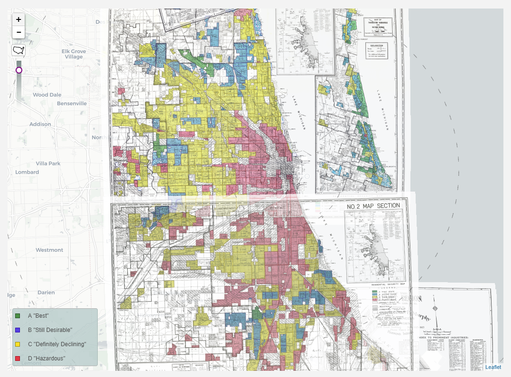

```{r setup, include=FALSE}
options(htmltools.dir.version = FALSE)
```

## Global urbanization

[The History of Urbanization - Max Galka/Metrocosm.com](http://metrocosm.com/map-history-cities.html)

---
class: center, middle, inverse

## Why do humans live in cities?  

---

## Recent urbanization


.footnote[Source: UN Population Prospects, the 2014 revision]

---

## Recent urbanization by region


.footnote[Source: UN Population Prospects, the 2014 revision]

---

## The growth of global cities

[World City Populations 1950-2030 (Duncan Smith/UCL)](http://luminocity3d.org/WorldCity/#3/12.00/10.00)

---

## World's largest cities over time


---
class: middle, inverse, center

# What is a city? 

---

## Urban definitions

* Megacity

* Global city

* Central business district

* Metropolitan area

* Suburbs & exurbs

---
class: middle, center, inverse

# How do we study cities?  

---

## Tools of urban studies

* Urban & social theory

* Mapping and geographic information science

* Quantitative analysis

* Qualitative methods

---

## Example: Chicago


.footnote[Source: The Atlantic/CityLab]

---

## Life expectancy in Chicago


.footnote[Source: The New York Times]

---

## Racial segregation in Chicago


.footnote[Source: https://demographics.virginia.edu/DotMap/]

---

## Scale, demographics, and perceptions of place


.footnote[Source: [FiveThirtyEight](https://fivethirtyeight.com/features/the-most-diverse-cities-are-often-the-most-segregated/)]

---

## Lending discrimination in Chicago



.footnote[Source: [Mapping Inequality project, University of Richmond](https://dsl.richmond.edu/panorama/redlining/#loc=11/41.8609/-87.6774&opacity=0.8&city=chicago-il)]

---

## Qualitative methods

About Washington Park in Chicago, from 1940 HOLC rating documents: 

> _This venture has the realtors guessing as to what the ultimate result will be when so many of this race are drawn into this section from the already negro-blighted district; particularly its effect on the section east and south of Cottage Grove, and to park and water frontage on Lake Michigan. Already Washington Park at the south, a very fine park, has been almost completely monopolized by the colored race._

.footnote[Source: [Mapping Inequality Project](https://dsl.richmond.edu/panorama/redlining/#loc=11/41.8609/-87.6774&opacity=0.8&city=chicago-il&area=D74&sort=295,45)]

---
class: middle, center, inverse

# Next up: Chicago...


<style>

h1, h2, h3 {
  color: #386890; 
}

a {
  color: #90b4d2; 
}

.inverse {
  background-color: #386890; 

}
</style>


