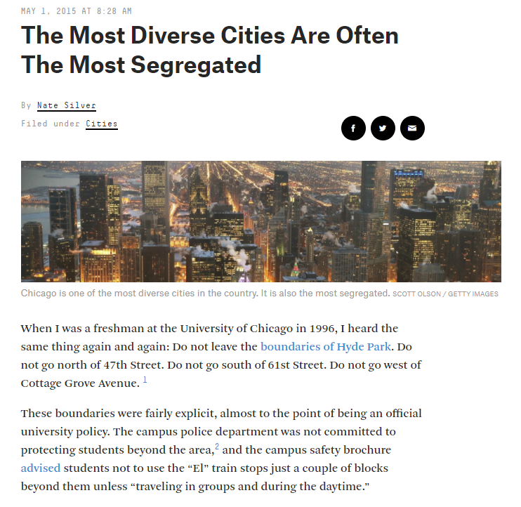
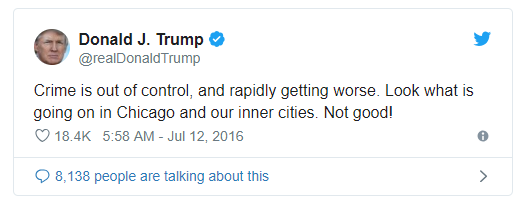
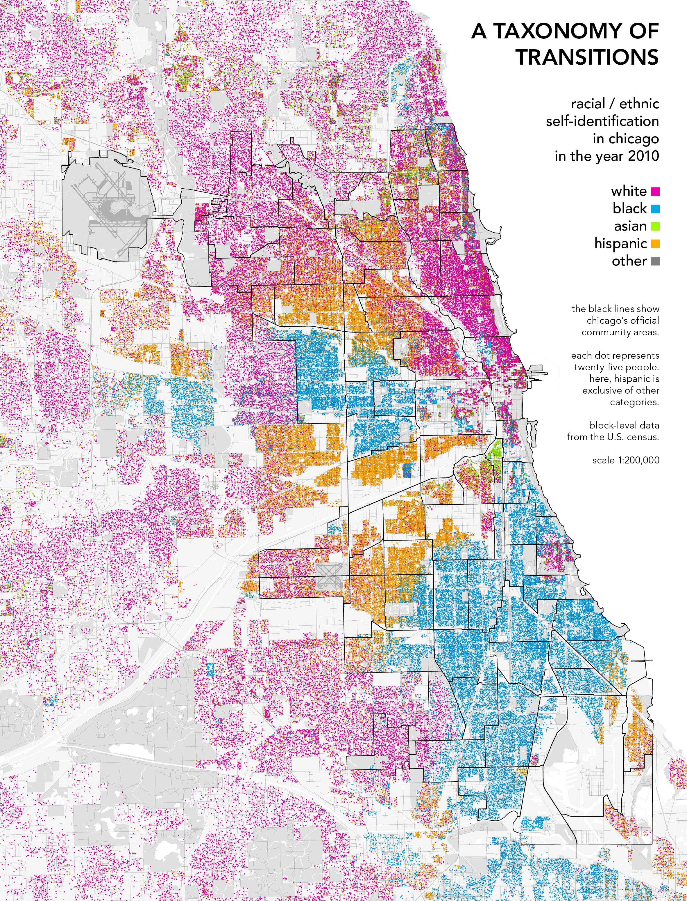

```{r setup, include=FALSE}
options(htmltools.dir.version = FALSE)
```

## Structure of the course

* Each week, we will explore a specific _theme_ in urban studies

* This theme will be explored through the lens of _a major world city or cities_

---

## This week's key themes

* The _hinterland_

* _Invasion and succession_

* Social scale

* Perceptions of place

---

## Chicago


.footnote[Source: ArchDaily]

---

## Chicago


---

## Early Chicago


.footnote[Source: Connecting the Windy City]

---

## Von Thunen's _Isolated State_


---

## Central place theory


.footnote[Source: [Penn State University](https://www.e-education.psu.edu/geog597i_02/sites/www.e-education.psu.edu.geog597i_02/files/Lesson4/09%20Central%20Place%20Theory_1.png)]

---
class: middle, center, inverse

# Urban models

---

## Modern urban definitions

* Central business district

* Metropolitan area

* Suburbs & exurbs

---

## The Chicago School of Sociology


.footnote[Source: Inside Higher Ed]

---

class: middle, center, inverse

## _The City_ (1925)

---

## The Burgess concentric zone model


---

## The "ecological" model of the city

* Key concept: _invasion and succession_

---

## The Burgess concentric zone model


---

## The Burgess concentric zone model

From _The City_, 1925: 

> _In the expansion of the city a process of distribution takes place which sifts and sorts and relocates individuals and groups by residence and occupation.  The resulting differentiation of the cosmopolitan American city into areas is typically all from one pattern, with only interesting minor modifications._ 

---

class: middle, center, inverse

## Components of the model

---

## The "inner city"

From _The City_, 1925: 

> _In the zone of deterioration encircling the central business section are always to be found the so-called "slums" and "bad lands," with their submerged regions of poverty, degradation, and disease, and their underworlds of crime and vice._

---
class: middle, center, inverse

## Where is the "inner city?"

---

## Perceptions of place



.footnote[Source: [FiveThirtyEight](https://fivethirtyeight.com/features/the-most-diverse-cities-are-often-the-most-segregated/)]

---

## Perceptions of place



---

## Cities and social scale

<iframe src="img/il_income.html" height = "500" width = "800" frameborder="0" scrolling="no"></iframe>

---

## Race and place in Chicago



.footnote[Source: [radicalcartography.net](http://www.radicalcartography.net/index.html?chicagodots)]
---

## The "ethnic enclave"

From _The City_, 1925: 

> _The slums are also crowded to over-flowing with immigrant colonies -- the Ghetto, Little Sicily, Greektown, Chinatown -- fascinatingly combining old world heritages and American adaptations_

---

## Industry in Old Chicago


.footnote[Source: Wikimedia Commons]

---

## Working conditions in the Chicago Stockyards

<iframe width="897" height="550" src="https://player.pbs.org/viralplayer/3066126265/" allowfullscreen allow="encrypted-media" style="border: 0;"></iframe>

---

## Immigrant enclaves in Chicago


.footnote[Source: [WBEZ Chicago](https://www.wbez.org/shows/wbez-news/the-tale-of-the-two-flat/8a385f49-42d6-4cd1-8978-666181064d59)]

---

## The Hull House in Chicago


.footnote[Source: Wikimedia Commons]

---

## Geography and upward mobility

From _The City_, 1925: 

> _The next zone is also inhabited predominatingly by factory and shop workers, but skilled and thrifty. This is an area of second immigrant settlement, generally of the second generation. It is the region of escape from the slum... But the inhabitant of this area in turn looks to the "Promised Land" beyond, to its residential hotels, its apartment-house region, its satellite loops, and its "bright light" areas._ 

---
class: center, middle, inverse

## Does the model work?  

---

## Alternative models


.footnote[Source: [_The Geography of Transport Systems_](https://transportgeography.org/?page_id=4920)]

---

## Los Angeles school of urbanism


---
class: center, middle, inverse

## Next week: New York City


<style>

h1, h2, h3 {
  color: #386890; 
}

a {
  color: #90b4d2; 
}

.inverse {
  background-color: #386890; 

}
</style>


