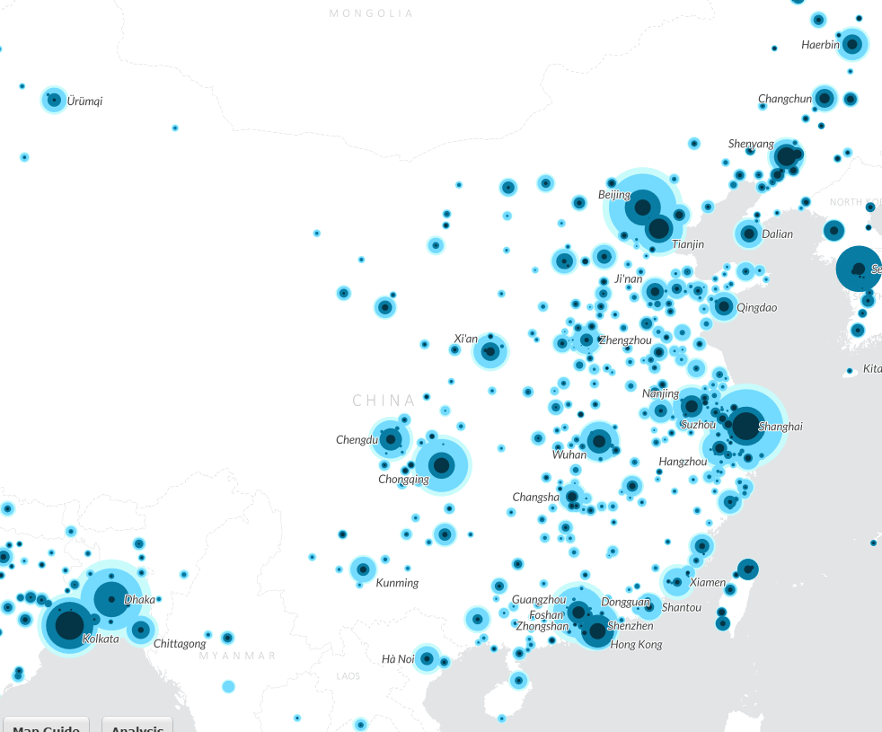
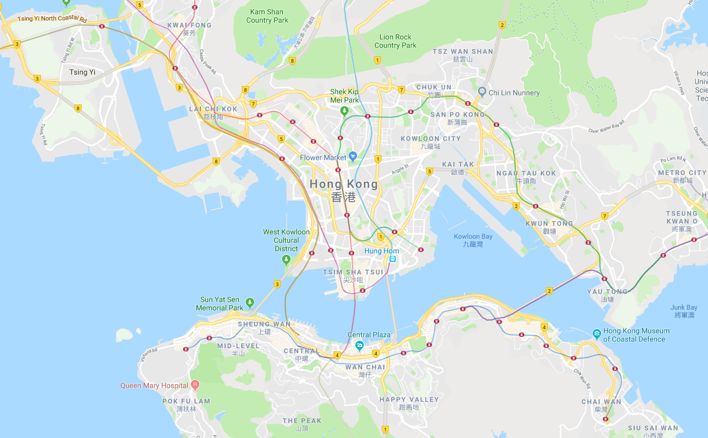

```{r setup, include=FALSE}
options(htmltools.dir.version = FALSE)
```

## This week's key themes

* Global cities

* China's economic transformation

* "Open cities" in China

* Negotiating politics and economics in Hong Kong

---

## Global cities


.footnote[Source: [Chicago Council on Global Affairs](https://www.youtube.com/watch?v=U4DiCdU-OLg)]

---

## Global cities


.footnote[Source: [A.T. Kearney](http://www.atkearney.in/research-studies/global-cities-index/2014)]

---

## Global cities

* [Interactive map: JLL Global 300](http://www.jll.com/cities-research/cities/global300map)

---
class: middle, center, inverse

## Shanghai

---

## Shanghai


.footnote[Source: [Skyrise Cities](https://skyrisecities.com/news/2016/01/ctbuh-marks-shanghai-tower-completion)]

---

## Shanghai


---

## China's economic transformation


.footnote[Source: [The Wall Street Journal](https://blogs.wsj.com/chinarealtime/2012/11/16/charting-chinas-economy-10-years-under-hu-jintao/)]

---

## Urban growth in China



.footnote[Source: [World City Populations, 1950-2030](http://luminocity3d.org/WorldCity/#5/35.353/109.248)]

---

## Shanghai's urban transformation


<span class="footnote">Source: [The Atlantic](https://www.theatlantic.com/photo/2013/08/26-years-of-growth-shanghai-then-and-now/100569/)</span>

---

## Open cities in China


.footnote[Source: [Shanghai Pilot Free Trade Zone](http://en.china-shftz.gov.cn/Investment/Services/14.shtml)]

---

## Urban change in Shanghai

<iframe allowfullscreen width='640' height='360' src='https://assets.nationalgeographic.com/modules-video/latest/assets/ngsEmbeddedVideo.html?guid=4a0d57e9-c84f-44fb-b310-75995bfd6e9f' frameborder='0' scrolling='no'></iframe>

---

## China's _hukou_ system


<span class="footnote">Source: Wikimedia Commons</span>

---
class: middle, center, inverse

## Hong Kong

---

## Hong Kong


.footnote[Source: [Lonely Planet](https://www.lonelyplanet.com/china/hong-kong)]

---

## Hong Kong 



---

## Hong Kong and the global economy


<span class="footnote">Source: [A.T. Kearney](http://www.atkearney.com/documents/10192/4461492/Global+Cities+Present+and+Future-GCI+2014.pdf/3628fd7d-70be-41bf-99d6-4c8eaf984cd5)</span>

---

## Urban life in Hong Kong

<iframe width="800" height="500" src="http://www.youtube.com/embed/Yma9LcOCFRw" frameborder="0" allowfullscreen></iframe>

<!--

Possibilities: 

http://www.journeyman.tv/60155/short-films/cage-dwellers.html; https://www.youtube.com/watch?v=HU4jjdRzy3w (13 mins)

https://www.youtube.com/watch?v=zm_BYX2qPsw (2 mins)

https://www.youtube.com/watch?v=Yma9LcOCFRw (2.5 mins)

https://www.youtube.com/watch?v=meR2N4H30Yg

-->

---

## Protests in Hong Kong


<span class="footnote">Source: [The Pundit Press](http://thepunditpress.com/2014/09/29/stunning-pictures-of-hong-kong-protests-92914/)</span>

---

## Macau


<span class="footnote">Source: *Gaming and Leisure News*</span>

---

class: middle, center, inverse

# Thanks everyone for a great semester!


<style>

h1, h2, h3 {
  color: #386890; 
}

a {
  color: #90b4d2; 
}

.inverse {
  background-color: #386890; 

}
</style>


