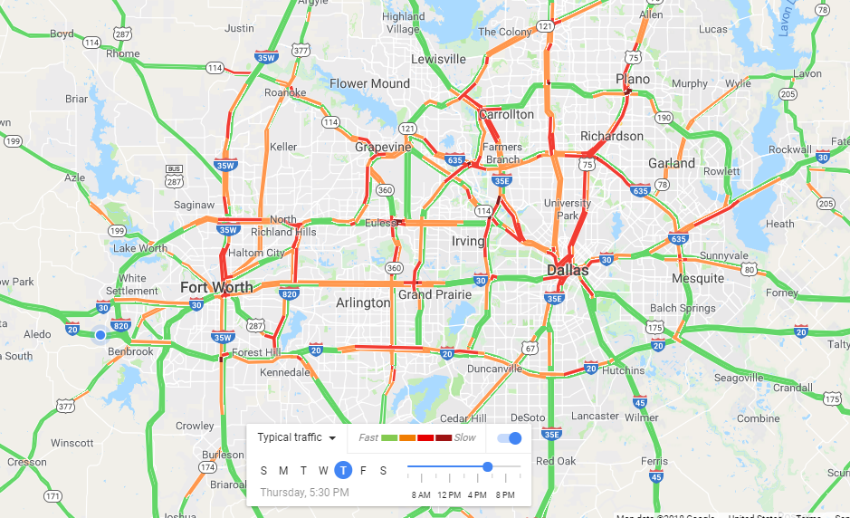

```{r setup, include=FALSE}
options(htmltools.dir.version = FALSE)
```

## This week's key themes

* Suburbanization

* The "American Dream"

* Automobility

* Edge cities

---

## Dallas-Fort Worth


---

## Dallas 


.footnote[Source: [_D Magazine_](https://www.dmagazine.com/frontburner/2014/09/why-dallas-was-chosen-the-best-skyline-in-the-world/)]

---

## Fort Worth


.footnote[Source: sundancesquare.com]

---

## Dallas and Fort Worth


.footnote[Source: [Thrillist](https://www.thrillist.com/entertainment/dallas/time-to-decide-once-and-for-all-dallas-or-ft-worth)]

---
class: middle, center, inverse

## The American suburb

---
class: middle, center, inverse

## Where are the suburbs in DFW? 

---

## Early suburbs 


.footnote[Source: [philadelphiaencyclopedia.org](https://philadelphiaencyclopedia.org/archive/streetcar-suburbs-2/)]

---

## Post-war suburbanization


.footnote[Source: levittownalive.com]

---

## Urban growth in the Metroplex

<iframe src="popchange.html" height = "550" width = "900" frameborder="0" scrolling="no"></iframe>

---

## Urban growth in the Metroplex


---
class: middle, center, inverse

## The "American Dream"

---

## Ideology and urban space


---

## Ideology and urban space

> "No one who owns his own house and lot can be a Communist. He has too much to do."

-- William Levitt, 1948

---

## Ideology and urban space


.footnote[Source: [_The New York Times_](http://www.nytimes.com/2009/07/24/opinion/24safire.html)]

---

## Ideology and urban policy


.footnote[[Image source](http://atomic-annhilation.blogspot.com/2014/01/1950-city-life-belts.html)]

---

## Images of suburbia

<iframe width="800" height="500" src="https://www.youtube.com/embed/y7f3dBf8k1Y" frameborder="0" allow="autoplay; encrypted-media" allowfullscreen></iframe>

---
class: middle, center, inverse

## Edge cities

---

## Edge cities 


.footnote[Source: hospitalityonline.com]

---

## Corporate headquarters in DFW


.footnote[Source: [Fortune Magazine](http://fortune.com/fortune500/visualizations/)]

---

## Jobs in DFW


.footnote[Source: [Robert Manduca, "Where Are The Jobs?"](http://www.robertmanduca.com/projects/jobs.html)]

---

## Commuting in DFW



---

## Commuting in metropolitan America


---

## Automobility


.footnote[Source: [dallashighfive.org](http://dallashighfive.org/)]

---

## Automobility and cities

<iframe width="800" height="550" src="https://www.youtube.com/embed/odF4GSX1y3c" frameborder="0" allow="autoplay; encrypted-media" allowfullscreen></iframe>

---

## The contemporary suburb

* [Racial/ethnic diversity in DFW](https://walkerke.shinyapps.io/neighborhood_diversity/)

* [Immigration in suburbia](http://personal.tcu.edu/kylewalker/immigrant-america/)

---

class: middle, center, inverse

# Next up: Detroit


<style>

h1, h2, h3 {
  color: #386890; 
}

a {
  color: #90b4d2; 
}

.inverse {
  background-color: #386890; 

}
</style>


