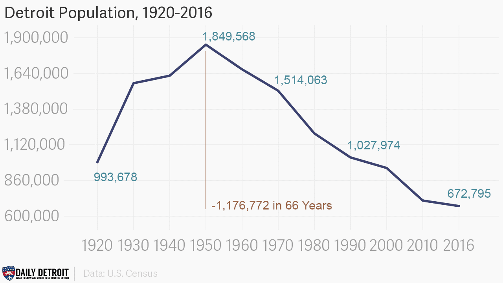
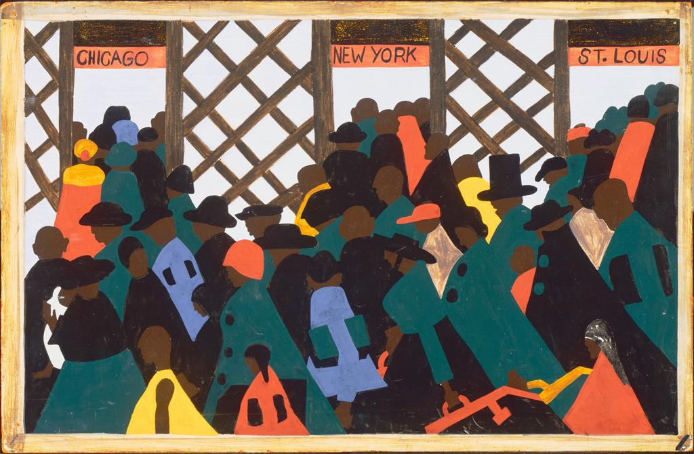
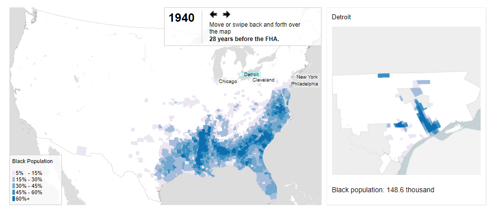
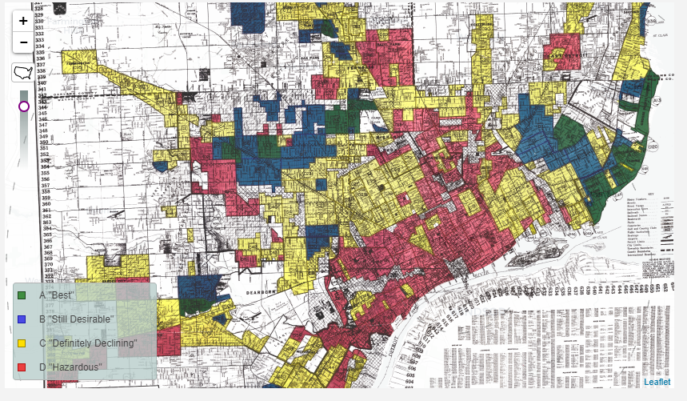
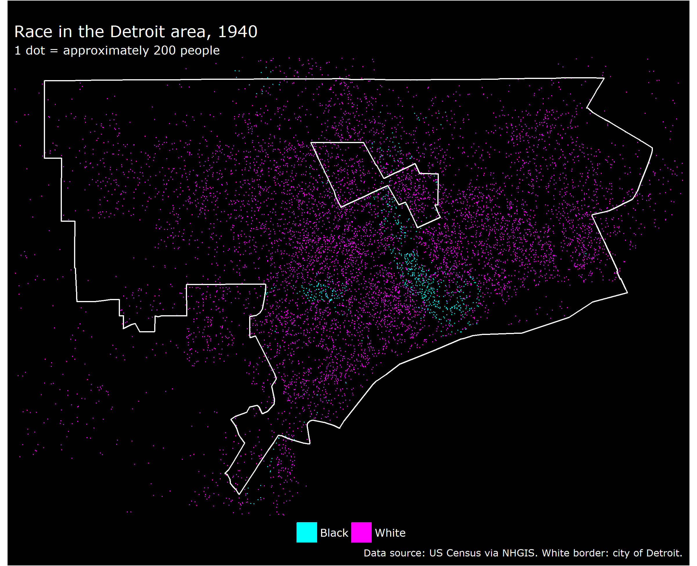
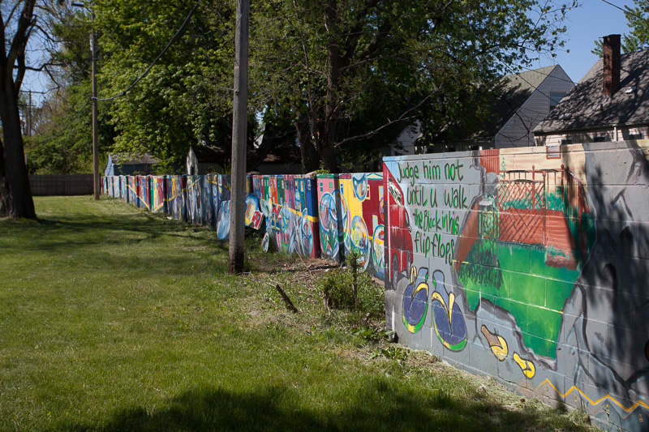
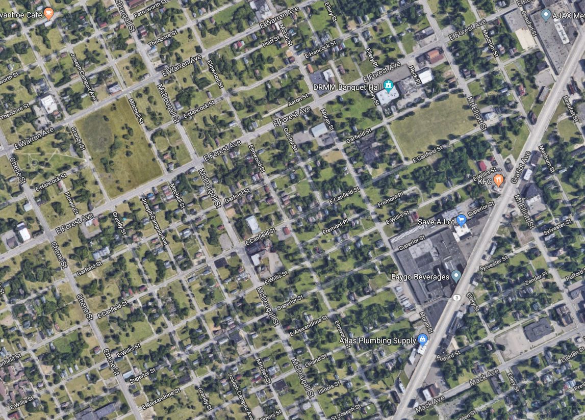

```{r setup, include=FALSE}
options(htmltools.dir.version = FALSE)
```

## This week's key themes

* The Great Migration

* Racial segregation

* Deindustrialization

* Urban decline and renewal

---

## Detroit


.footnote[Source: Michigan.org]

---

## Detroit


---

## History of Detroit


.footnote[Source: Wikimedia Commons]

---

## History of Detroit


.footnote[Source: [MLive.com](https://www.mlive.com/news/detroit/2018/01/historic_photos_fords_assembly.html)]

---

## Detroit's population over time



.footnote[Source: [Daily Detroit](http://www.dailydetroit.com/2017/05/25/detroit-continues-lose-population-according-new-census-data/)]

---

class: middle, center, inverse

## The Great Migration

---

## The Great Migration



.footnote[Source: [analepsis.org](http://analepsis.org/2012/03/25/the-great-migration-series-by-jacob-lawrence-hum225/)]

---

## The Great Migration


.footnote[Source: [US Census Bureau](https://www.census.gov/dataviz/visualizations/020/)]

---

## The Great Migration



.footnote[Source: [ProPublica](http://projects.propublica.org/graphics/city-maps)]

---
class: middle, center, inverse

## Racial segregation

---

## Segregation

* **Segregation**: the geographical separation of two or more groups of people in a given space

 * Roles of sorting and discrimination in urban segregation
 
* Racial segregation declining in most cities; segregation by income on the rise

---

## Segregation and housing policy



.footnote[Source: [Mapping Inequality project](https://dsl.richmond.edu/panorama/redlining/#loc=11/42.3778/-83.1483&opacity=0.8&city=detroit-mi)]

---

## Segregation and housing policy

Key terms: 

* Restrictive covenants

* Blockbusting and racial steering

* The Fair Housing Act

* "White flight"

---

## Population change in Detroit


.footnote[Source: [Family Inequality blog](https://familyinequality.wordpress.com/2014/12/01/detroits-decline/)]

---

## Population change in Detroit



---

## Racial segregation in Detroit


.footnote[Source: [Census Dots](https://www.censusdots.com/?map=12.25,42.3952,-83.1083)]

---

## 8 Mile Road



.footnote[Source: [DetroitUrbex.com](http://detroiturbex.com/content/neighborhoods/8milewall/index.html)]

---

## 8 Mile Road

<iframe width="750" height="525" src="https://www.youtube.com/embed/9gMBXg-HF4o" frameborder="0" allow="autoplay; encrypted-media" allowfullscreen></iframe>

---
class: middle, center, inverse

## Deindustrialization

---

## The "Rust Belt"


.footnote[Source: [Flat World Knowledge](https://catalog.flatworldknowledge.com/bookhub/reader/15119?e=trowbridge2_1.0-ch12_s02)]

---

## The automobile industry and Detroit


.footnote[Source: WDET.org]

---

## Automobile manufacturing


.footnote[Source: [Mackinac Center for Public Policy](https://www.mackinac.org/21310)]

---

## Deindustrialization and Detroit

* [Video: Detroit's Packard Automobile Plant](https://aeon.co/videos/a-poetic-tour-through-detroits-abandoned-ghostly-packard-automotive-plant)

---

## Detroit and the "Great Divergence"


.footnote[Source: [Family Inequality blog](https://familyinequality.wordpress.com/2014/12/01/detroits-decline/)]

---
class: middle, center, inverse

## Urban decline and renewal

---

## Urban decline



---

## Clearing urban "blight"


---

## Population change in Detroit

<iframe src="wayne_change.html" height = "500" width = "750" frameborder = "0" scrolling="no"></iframe>

---

## Urban renewal in Detroit


.footnote[Source: [Cadillac Square](https://www.developmentcadillacsquare.com/)]

---

class: middle, center, inverse

# Next up: Vancouver and Montreal


<style>

h1, h2, h3 {
  color: #386890; 
}

a {
  color: #90b4d2; 
}

.inverse {
  background-color: #386890; 

}
</style>


