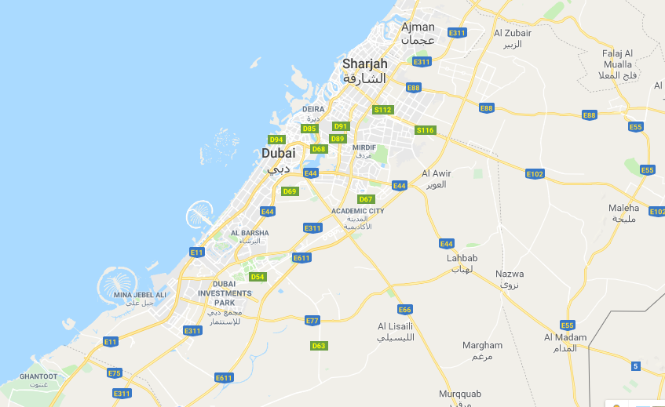

```{r setup, include=FALSE}
options(htmltools.dir.version = FALSE)
```

## This week's key themes

* The world's first cities

* Cities and Islam

* Natural resources and urban economies

* Urban spectacle in the Middle East

* Labor migration and inequality in boomtowns

---

## The 'cradle of civilization'


<span class="footnote">Source: Wikimedia Commons</span>

<!-- (discuss agriculture in fertile crescent, Tigris & Euphrates; major religious traditions; civilizational advances, historically, that came out of this realm) -->

---

## Early urbanization

[The History of Urbanization - Max Galka/Metrocosm.com](http://metrocosm.com/map-history-cities.html)

---

## Early urbanization


.footnote[Source: Wikimedia Commons]

---

## Early urbanization


.footnote[Source: Wikimedia Commons]

---

## Urban culture


---

## Urban culture


.footnote[Source: [JSTOR](https://daily.jstor.org/advanced-mathematics-of-ancient-babylon/)]


---
class: middle, center, inverse

## Natural resources and urban economies

---

### Oil reserves by country, 2016 (billions of barrels)

<iframe src="oil_waffle.html" frameborder="0" height="500" width="800"></iframe>

.footnote[Source: [US EIA](http://www.eia.gov/beta/international/data/browser/#/?pa=0000000000000000000008&c=ruvvvvvfvtvnvv1urvvvvfvvvvvvfvvvou20evvvvvvvvvnvvuvo&ct=0&tl_id=5-A&vs=INTL.57-6-AFG-BB.A&ord=SA&cy=2014&vo=0&v=H&start=1980)]

---

### Gas reserves by country, 2016 (trillions of cubic meters)

<iframe src="gas_waffle.html" frameborder="0" height="500" width="800"></iframe>

---

## Wealth in the Middle East

<iframe width='100%' height='500' frameborder='0' src='https://kwalkertcu.cartodb.com/viz/b788b5be-cd74-11e4-90ce-0e4fddd5de28/embed_map' allowfullscreen webkitallowfullscreen mozallowfullscreen oallowfullscreen msallowfullscreen></iframe>

---
class: middle, center, inverse

## Dubai

---

## Dubai


.footnote[Source: [The Telegraph](https://www.telegraph.co.uk/travel/destinations/middle-east/united-arab-emirates/dubai/)]

---

## Dubai



---

## Dubai


.footnote[Source: Bayut]

---
class: middle, center, inverse

## Urban spectacle in the Middle East

---

## Construction in Dubai


.footnote[Source: [Arabian Business/Bloomberg](http://www.arabianbusiness.com/uae-construction-companies-are-feeling-pain-673360.html)]

---

## Urban spectacle in Dubai

<iframe width="700" height="450" src="https://www.youtube.com/embed/EctE3dEAwEY?rel=0" frameborder="0" allow="autoplay; encrypted-media" allowfullscreen></iframe>


---

## Economics of Dubai


.footnote[Source: [Bloomberg View](https://www.bloomberg.com/view/articles/2018-01-14/dubai-s-the-very-model-of-a-modern-mideast-economy)]

---

## Economics of Dubai


.footnote[[Image source](https://www.saifaudit.com/images/product/jafza.jpg)]

---

## Urban spectacle in Saudi Arabia: NEOM


.footnote[[Image source: NEOM](https://www.google.com/url?sa=i&url=https%3A%2F%2Fwww.neom.com%2Fen-us&psig=AOvVaw2A2hgQfIfepwUbEaUdzmC1&ust=1668034064062000&source=images&cd=vfe&ved=0CAwQjRxqFwoTCMirnqPVn_sCFQAAAAAdAAAAABAI)]

---

## NEOM: The Line

<iframe width="560" height="315" src="https://www.youtube.com/embed/0kz5vEqdaSc" title="YouTube video player" frameborder="0" allow="accelerometer; autoplay; clipboard-write; encrypted-media; gyroscope; picture-in-picture" allowfullscreen></iframe>

---
class: middle, center, inverse

## Doha

---

## Doha


.footnote[Source: [alwatannews.net](http://alwatannews.net/article/722313/Gulf/%D9%85%D9%87%D9%84%D8%A9-%D9%82%D8%B7%D8%B1-%D8%AA%D9%86%D8%AA%D9%87%D9%8A-%D9%85%D8%B3%D8%A7%D8%A1-%D9%88%D9%85%D8%B3%D8%A7%D8%B9-%D8%AF%D9%88%D9%84%D9%8A%D8%A9-%D8%AA%D8%AD%D8%AB-%D8%A7%D9%84%D8%AF%D9%88%D8%AD%D8%A9-%D8%B9%D9%84%D9%89-%D8%A7%D9%84%D8%AD%D9%84)]

---

## Doha


---

class: middle, center, inverse

## Labor migration and inequality in boomtowns

---

## Migration to Southwest Asia

* [Migration statistics from the Pew Research Center](http://www.pewsocialtrends.org/2013/12/17/migration-tables/)

* [Origins of migrants in the region](http://peoplemov.in)


<!-- * Basic stats about the extensive migrant populations in this realm; how they are building everything (under auspicious circumstances) -->

---

## Population pyramid of Qatar

<iframe src="qatar.html" frameborder="0" seamless scrolling="no" height="550" width="1000"></iframe>

---

## Building Doha


.footnote[Source: [Construction Week Online](http://www.constructionweekonline.com/article-7256-city-update-doha/)]

---

## The 2022 World Cup

<center></center>

.footnote[Source: Wikimedia Commons]

---

## Stadium construction in Doha


.footnote[Source: [Arab News](http://www.arabnews.com/node/1129671/middle-east)]

---

## Qatar 2022: "Journey to Amazing"

<iframe width="560" height="315" src="https://www.youtube.com/embed/zNmFgW_KWBk" frameborder="0" allow="accelerometer; autoplay; encrypted-media; gyroscope; picture-in-picture" allowfullscreen></iframe>

---

## Labor migration and the World Cup 

- Updated version available on ESPN+

<iframe src="https://player.vimeo.com/video/298182999" width="640" height="360" frameborder="0" allow="autoplay; fullscreen" allowfullscreen></iframe>
<p><a href="https://vimeo.com/298182999">E:60 Qatar</a> from <a href="https://vimeo.com/bluefoot">Bluefoot</a> on <a href="https://vimeo.com">Vimeo</a>.</p>

---

## Human rights and Qatar


.footnote[Source: [The Telegraph](https://www.telegraph.co.uk/sport/football/world-cup/10353367/Fifas-crunch-meeting-on-2022-World-Cup-in-Qatar-overshadowed-by-human-rights-storm.html)]

---


class: middle, center, inverse

# Next up: Lagos


<style>

h1, h2, h3 {
  color: #386890; 
}

a {
  color: #90b4d2; 
}

.inverse {
  background-color: #386890; 

}
</style>


