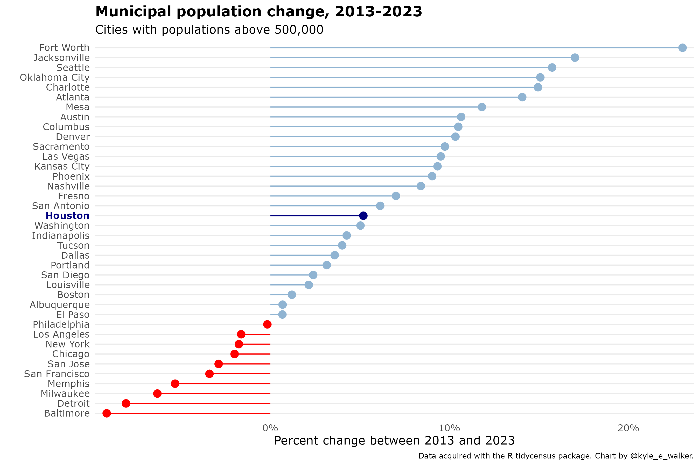
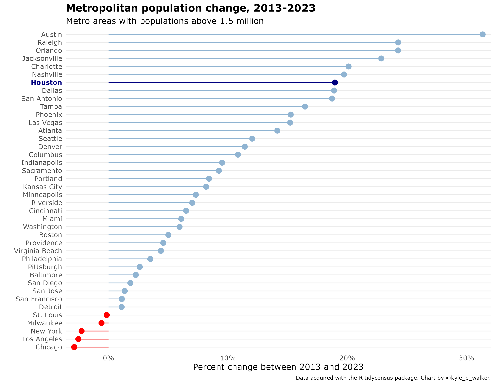

```{r setup, include=FALSE}
options(htmltools.dir.version = FALSE)
```

## This week's key themes

* Zoning

* Urban environmental management

---

## Houston


.footnote[Source: [City of Houston](http://www.houstontx.gov/abouthouston/)]

---

## Houston


---

## Houston


.footnote[Source: [Visit Houston](https://www.visithoustontexas.com/about-houston/history/)]

---

## Houston and industry


.footnote[Source: [Houston Chronicle](https://www.houstonchronicle.com/business/columnists/tomlinson/article/Gasoline-prices-mean-big-break-for-Americans-but-5917427.php)]

---

## Zoning

* Example: [Zoning in New York City](https://zola.planning.nyc.gov/about#9.72/40.7125/-73.733)

---

## Houston and urban development

> _The city of Houston does not have zoning but development is governed by codes that address how property can be subdivided. The City codes do not address land use._

* Development letter: http://www.houstontx.gov/planning/Forms/devregs/2018_no_zoning_letter.pdf

---

## Houston and urban development

* [Gallery of images of Houston's lack of zoning laws - Houston Chronicle](https://www.chron.com/news/houston-texas/houston/article/Weirdest-images-from-Houston-s-lack-of-zoning-laws-9171688.php#photo-10773147)

---

## Population change in Houston



---

## Population change in Houston



---
class: inverse, middle, center

## Hurricane Harvey and its aftermath

---

## Hurricane Harvey


.footnote[Source: [_The New York Times_](https://www.nytimes.com/interactive/2017/08/24/us/hurricane-harvey-texas.html)]

---

## Flooding in Houston


.footnote[Source: [The Washington Post](https://www.washingtonpost.com/graphics/2017/investigations/harvey-urban-planning/?utm_term=.48535b9525bc)]

---

## Flooding in Houston


[Interactive version](https://www.nytimes.com/interactive/2017/08/24/us/hurricane-harvey-texas.html)

.footnote[Source: _The New York Times_]

---
class: middle, center, inverse

## Why was Houston at risk?  

---

## Environmental management and Houston


.footnote[Source: [Texas Tribune/ProPublica](https://apps.texastribune.org/harvey-reservoirs/)]

---

## Environmental risk in Houston


.footnote[Source: [_The New York Times_](https://www.nytimes.com/interactive/2017/11/11/climate/houston-flooding-climate.html)]

---

## Environmental risk and urban development

<iframe width="560" height="315" src="https://www.youtube.com/embed/IEKJx8qmoTM" frameborder="0" allow="accelerometer; autoplay; encrypted-media; gyroscope; picture-in-picture" allowfullscreen></iframe>

---

## Environmental risk and urban planning


.footnote[Source: [The Washington Post](https://www.washingtonpost.com/graphics/2017/investigations/harvey-urban-planning/?utm_term=.48535b9525bc)]

---

class: middle, center, inverse

# Next up: Dallas-Fort Worth


<style>

h1, h2, h3 {
  color: #386890; 
}

a {
  color: #90b4d2; 
}

.inverse {
  background-color: #386890; 

}
</style>


