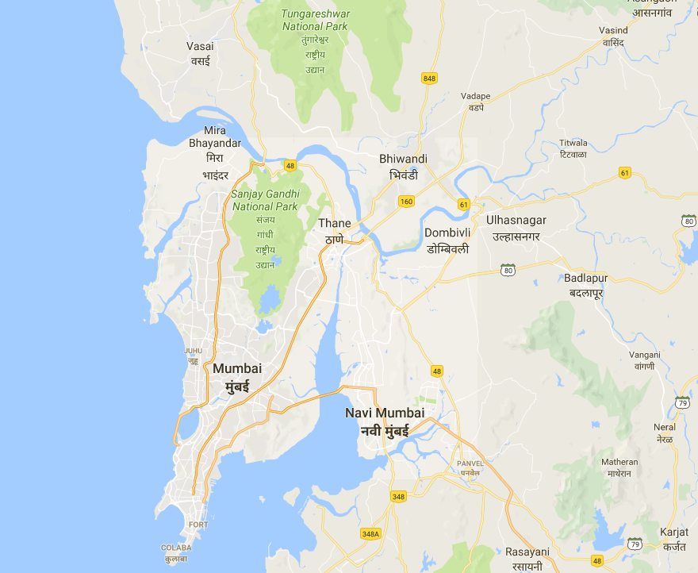
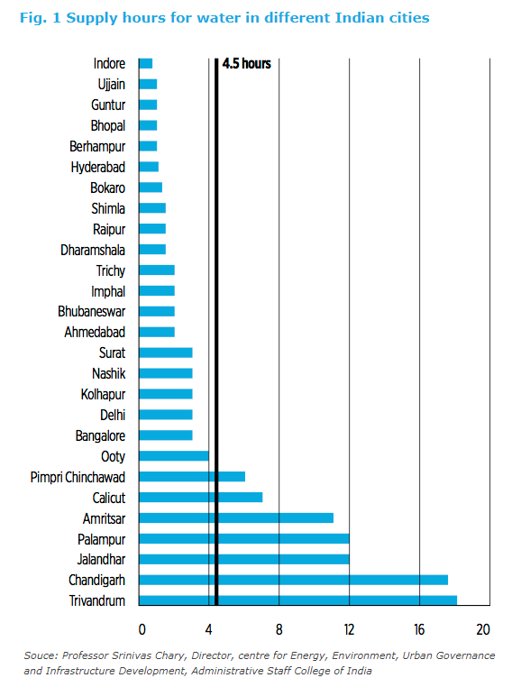

```{r setup, include=FALSE}
options(htmltools.dir.version = FALSE)
```

## This week's key themes

* Urban environmental sustainability

* Urbanization in India

* Waste management in megacities

* Geographies of water access and pollution


---
class: middle, center, inverse

## Urban environmental sustainability

---

## Environmental sustainability


.footnote[Source: [Syniverse](https://www.syniverse.com/environmental-sustainability)]

---

## Cities and the environment


.footnote[Source: [Modern Farmer](https://modernfarmer.com/2016/09/portland-urban-growth-boundary/)]

---

## "Sustainable" cities


.footnote[Source: [National Geographic](https://news.nationalgeographic.com/energy/2015/03/150328-green-roofs-france-buildings-energy/)]

---
class: middle, center, inverse

## Mumbai

---

## Mumbai


.footnote[Source: [PropTiger.com](https://www.proptiger.com/guide/post/mumbais-top-5-tallest-buildings)]

---

## Mumbai



---

## Mumbai


.footnote[Source: [IndianExpress.com](http://indianexpress.com/article/research/mumbai-flood-2017-if-bombays-drainage-system-led-to-the-plague-of-1896-august-29-showed-mumbai-isnt-any-better-off/)]

---

## Urbanization in India


.footnote[Source: [World City Populations 1950-2030](http://luminocity3d.org/WorldCity/#5/22.431/73.564)]

---

## Urbanization in India 


.footnote[Source: [The Economist](https://www.economist.com/blogs/graphicdetail/2012/01/daily-chart-6)]

---

## Urban growth in Mumbai


.footnote[Source: [Atlas of Urban Expansion](http://atlasofurbanexpansion.org/cities/view/Mumbai)]

---

## Development in Mumbai

<iframe src="https://www.google.com/maps/embed?pb=!4v1524504024751!6m8!1m7!1sgK5_Mq5bixwhHpG8w72OFA!2m2!1d19.06085455399321!2d72.86416448620318!3f275.24868535891056!4f2.484371098238057!5f0.7820865974627469" width="600" height="450" frameborder="0" style="border:0" allowfullscreen></iframe>

---

## Slums in Mumbai

<iframe src="https://www.google.com/maps/embed?pb=!4v1524504167095!6m8!1m7!1sCAoSLEFGMVFpcE1PYzVNRkY5RWFmTHZidlQ2ek9YMTg0OXRsUENqVjQzbWV1clkw!2m2!1d19.0472763!2d72.8541326!3f314.00349942108517!4f-7.139196454383551!5f0.7820865974627469" width="600" height="450" frameborder="0" style="border:0" allowfullscreen></iframe>

---
class: middle, center, inverse

## Waste management in megacities

---

## Cities and waste


.footnote[Source: [The World Bank](https://siteresources.worldbank.org/INTURBANDEVELOPMENT/Resources/336387-1334852610766/Chap3.pdf)]

---

## Waste management in Mumbai


.footnote[Source: [Hindustan Times](https://www.hindustantimes.com/mumbai-news/102-bulk-waste-generators-in-mumbai-s-powai-only-iit-b-composts-garbage/story-KVDWQOuYWPKRMjrMOAKSKI.html)]

---

## Waste management in Mumbai

<iframe width="560" height="315" src="https://www.youtube.com/embed/yUY7wwdZCvg?rel=0" frameborder="0" allow="autoplay; encrypted-media" allowfullscreen></iframe>

---
class: middle, center, inverse

## Delhi

---

## Delhi


.footnote[Source: [Travel Massive](https://travelmassive.com/chapters/delhi)]

---

## Delhi


---

## Delhi


.footnote[[Image source](http://nalin-jharoka.blogspot.com/2012/10/history-of-delhi-1857-jama-masjid.html)]

---
class: middle, center, inverse

## Water access in Delhi

---

## Water and the Indian megacity



.footnote[Source: [International Water Association](https://www.thesourcemagazine.org/the-value-of-247-water/)]

---

## Water and the Indian megacity


.footnote[Source: [Bloomberg News](https://assets.bwbx.io/images/users/iqjWHBFdfxIU/iAeMpTfANllQ/v1/-1x-1.jpg)]

---

## Water in Delhi


.footnote[Source: [USAID/Safe Water Network](http://www.safewaternetwork.org/sites/default/files/Safe%20Water%20Network_Delhi%20City%20Report.PDF)]

---
class: middle, center, inverse

## Pollution and megacities

---

## Pollution in Delhi 


.footnote[Source: [CNN](https://www.cnn.com/2016/11/07/asia/india-new-delhi-smog-pollution/index.html)]

---

## Pollution in Delhi


.footnote[Source: [Vox.com](https://www.vox.com/energy-and-environment/2017/11/22/16666808/india-air-pollution-new-delhi)]

---

## The Yamuna River

<iframe width="560" height="315" src="https://www.youtube.com/embed/eHCaIvPN2rY" frameborder="0" allow="autoplay; encrypted-media" allowfullscreen></iframe>

---

class: middle, center, inverse

# Next up: Shanghai and Hong Kong


<style>

h1, h2, h3 {
  color: #386890; 
}

a {
  color: #90b4d2; 
}

.inverse {
  background-color: #386890; 

}
</style>


