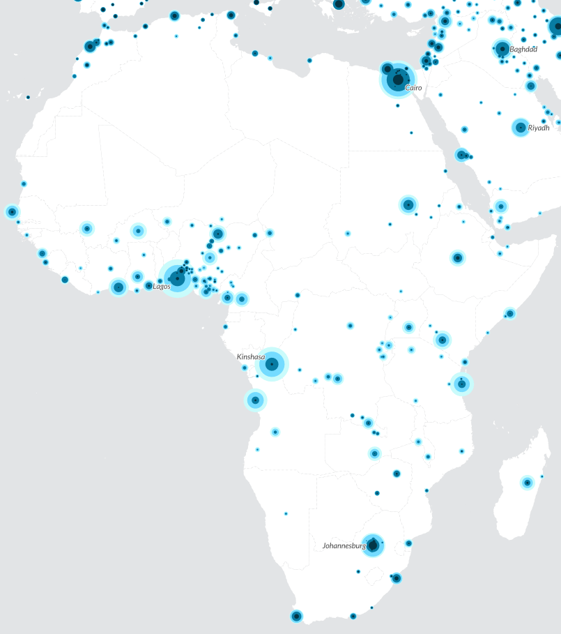
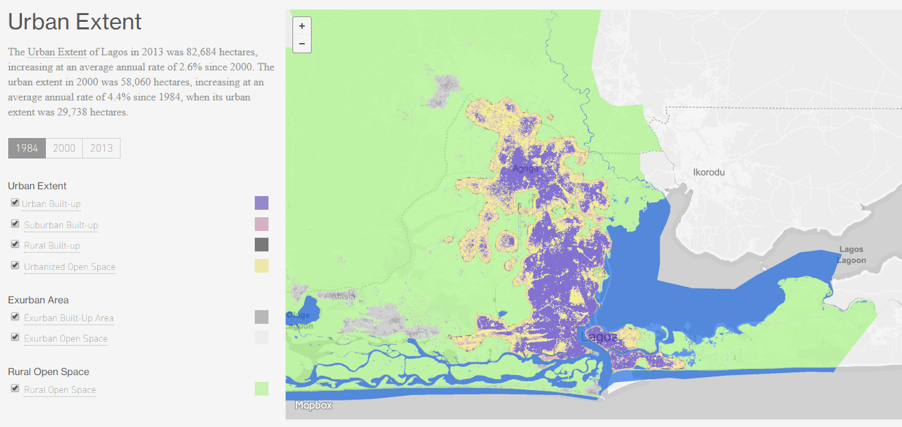

```{r setup, include=FALSE}
options(htmltools.dir.version = FALSE)
```

## This week's key themes

* Urbanization and world population growth

* Demography and cities

* Managing urban growth in Lagos

---

## Africa: demographics

* Presently, Africa's population is around 1.1 billion (15 percent of the world's population)

* Population under age 15: ~451 million (24 percent of the world's population under 15)


---

## Global population growth


.footnote[[Link to interactive version](http://walkerke.github.io/teaching-with-datavis/un-projections/regions.html)]

---

## Geography of population change

* [Interactive map: global population growth and decline](https://tcugis.maps.arcgis.com/apps/Embed/index.html?webmap=aad6f706a5b4455bbde2df81b140a291&extent=-125.4199,-34.3071,101.5137,73.3279&zoom=true&previewImage=false&scale=false&legend=true&disable_scroll=false&theme=light) 

---

## The world's largest countries


<span class="footnote">Source: _The Economist_ [(animated version)](https://twitter.com/aronstrandberg/status/671742548495478785)</span>

---


## Urbanization in Africa


<span class="footnote">Source: United Nations</span>

---

## Urban characteristics



.foonote[Source: [World City Populations 1950-2030](http://luminocity3d.org/WorldCity/#4/0.53/-3.43)]

<!--


<span class="footnote">Source: *The Economist*</span>

-->

---
class: middle, center, inverse

## Lagos

---

## Lagos


<span class="footnote">Source: [US Department of the Treasury](http://www.treasury.gov/connect/blog/Pages/Africa-Surges-Forward.aspx)</span>

---

## Lagos


---
class: middle, center, inverse

## Population change

---

## Population change

* Population change in societies a function of the __demographic balancing equation__

* Key concept: __replacement fertility__

---

## Population pyramid: Nigeria


---

## Fertility in Nigeria

* [Explore: fertility by state in Nigeria](http://rpubs.com/walkerke/nigeria-tfr)

---

## Mortality in Nigeria

<iframe src="imr.html" width = "800" height="500" frameborder="0" scrolling="no"></iframe>

---

## Cities and migration: Lagos

<iframe width="800" height="550" src="https://www.youtube.com/embed/oyni7iI579Y?rel=0" frameborder="0" allowfullscreen></iframe>

---

## Makoko


.footnote[Source: [designboom.com](https://www.designboom.com/architecture/nle-architects-floating-school-in-makoko/)]

---
class: middle, center, inverse

## Managing growth in Lagos

---

## Urban expansion in Lagos



.footnote[Source: [Atlas of Urban Expansion](http://atlasofurbanexpansion.org/cities/view/Lagos)]

---

## Transportation infrastructure in Lagos

<iframe width="700" height="450" src="https://www.youtube.com/embed/oyni7iI579Y?rel=0&amp;start=566" frameborder="0" allow="autoplay; encrypted-media" allowfullscreen></iframe>

---

## Slum clearance in Lagos

<iframe width="700" height="450" src="https://www.youtube.com/embed/oyni7iI579Y?rel=0&amp;start=960" frameborder="0" allow="autoplay; encrypted-media" allowfullscreen></iframe>

---

class: middle, center, inverse

# Next up: Mumbai & Delhi


<style>

h1, h2, h3 {
  color: #386890; 
}

a {
  color: #90b4d2; 
}

.inverse {
  background-color: #386890; 

}
</style>


