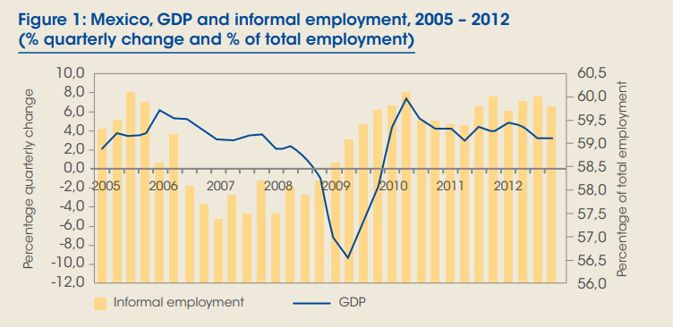
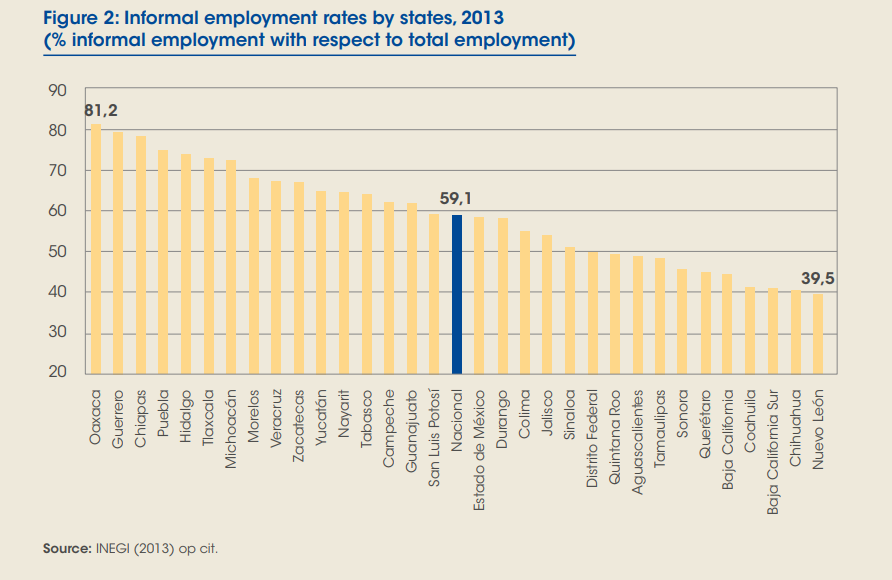

```{r setup, include=FALSE}
options(htmltools.dir.version = FALSE)
```

## This week's key themes

* Urbanization in the developing world

* Rural-to-urban migration

* Migration and labor markets

* The informal economy and informal settlements

---

## Mexico City


.footnote[Source: Wikimedia Commons]

---

## Mexico City


---

## Mexico City 


.footnote[Source: [joelgehringer.com](http://joelgehringer.com/blog/the-city-of-dreams/)/various]

---

## The Latin American city model


---

## Global urbanization


.footnote[Source: UN Population Prospects, the 2014 revision]

---

## Urbanization by region


.footnote[Source: UN Population Prospects, the 2014 revision]

---

## Megacities

* Urban agglomerations of 10 million people or more

* Massive *rural-to-urban migration* in much of the Global South

* Megacities in Latin America: Mexico City (Mexico); Sao Paolo, Rio de Janeiro (Brazil); Buenos Aires (Argentina); Bogota (Colombia); Lima (Peru)

---

## Megacities 

[World City Populations 1950-2030 - Duncan Smith](http://luminocity3d.org/WorldCity/#4/-13.15/-48.16)

---
class: middle, center, inverse

## The economics of rural-to-urban migration

---

## 'Sectors' of the economy

* Primary sector

* Secondary sector

* Tertiary sector

* Quaternary sector

---

## Manufacturing in Mexico and the U.S.


---

## Sector employment in North America


---

## NAFTA

* NAFTA: **N**orth **A**merican **F**ree **T**rade **A**greement 

* 2020 update: the [USMCA](https://ustr.gov/trade-agreements/free-trade-agreements/united-states-mexico-canada-agreement/fact-sheets/modernizing)

---

## Urban expansion in Mexico City

[Animation from the Atlas of Urban Expansion](http://atlasofurbanexpansion.org/file-manager/userfiles/data_page/Animations/Mexico.mp4)

---

## Urban expansion in Mexico City


.footnote[Source: [Atlas of Urban Expansion](http://atlasofurbanexpansion.org/cities/view/Mexico_City)]

---

## Rural to urban migration in Mexico City

<iframe width="750" height="500" src="https://www.youtube.com/embed/8JTr13ryswc" frameborder="0" allow="autoplay; encrypted-media" allowfullscreen></iframe>

---

## Megacities: a study in contrasts


.footnote[Source: [Johnny Miller/Daily Mail](http://www.dailymail.co.uk/news/article-4029410/Mexico-s-wealth-gap-laid-bare-Extraordinary-photos-rich-live-destitute-unequal-society.html)]

---

## Megacities: a study in contrasts


.footnote[Source: [Johnny Miller/Daily Mail](http://www.dailymail.co.uk/news/article-4029410/Mexico-s-wealth-gap-laid-bare-Extraordinary-photos-rich-live-destitute-unequal-society.html)]

<!-- Have a look at Rio in Google Maps; show street view.  Compare area around Ipanema/Copacabana with Rocinha favela; look at Street View, Earth View -->

---

## Slums in the global south

Key terms: 

* Informal settlements

* The informal economy

<!-- Discuss: informal economy, rural to urban migration, etc.   -->


---

## Slums in the global south 

Worldwide: about 1 in 8 people live in slums (around 1 billion); around 30 percent of urban dwellers in the developing world

Slums (UN definition): households lacking one or more of the following: 

--

* Access to improved water source

--

* Access to improved sanitation facilities

--

* Sufficient living area

--

* Housing durability

--

* Security of tenure


---

class: middle, center, inverse

## The informal economy

---

## The informal economy in Mexico



.footnote[Source: [International Labor Organization](http://www.ilo.org/wcmsp5/groups/public/---americas/---ro-lima/documents/publication/wcms_245889.pdf)]

---

## The informal economy in Mexico



.footnote[Source: [International Labor Organization](http://www.ilo.org/wcmsp5/groups/public/---americas/---ro-lima/documents/publication/wcms_245889.pdf)]

---

## The informal economy in Mexico City

<iframe width="750" height="500" src="https://www.youtube.com/embed/v6KXU9eL4Y8" frameborder="0" allow="autoplay; encrypted-media" allowfullscreen></iframe>

---

## The informal economy in Mexico City

<iframe width="750" height="500" src="https://www.youtube.com/embed/fzzZ0PIYUAM" frameborder="0" allow="autoplay; encrypted-media" allowfullscreen></iframe>

---

## Managing the megacity


.footnote[Source: [CityLab](https://www.bloomberg.com/news/articles/2017-06-28/how-a-slum-became-a-city)]

---


class: middle, center, inverse

# Next up: Rio de Janeiro


<style>

h1, h2, h3 {
  color: #386890; 
}

a {
  color: #90b4d2; 
}

.inverse {
  background-color: #386890; 

}
</style>


