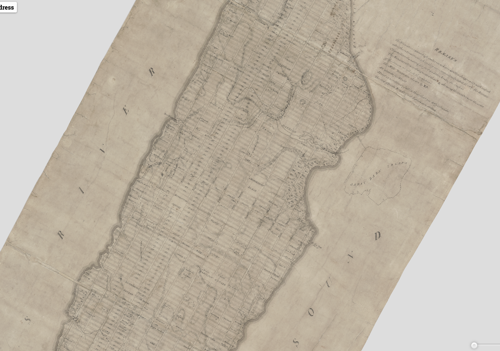
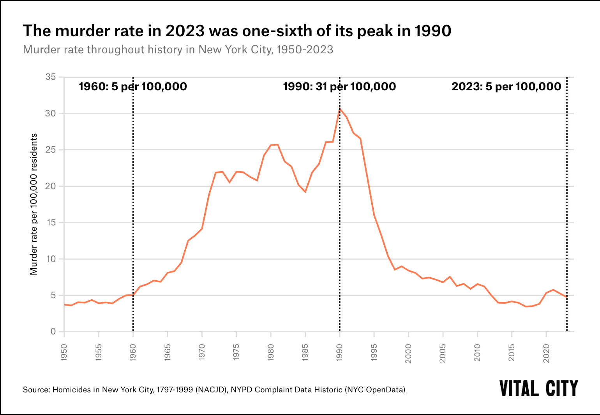

```{r setup, include=FALSE}
options(htmltools.dir.version = FALSE)
```

## This week's key themes

* The neighborhood

* The city in popular culture

* Gentrification

* Demographic inversion


---

## New York

<center></center>

---

## New York


---

## Early New York: _Mannahatta_ 

* https://www.welikia.org/map-explorer


.footnote[Source: [The Welikia Project](https://welikia.org/)]

---

## Early New York


.footnote[Source: [Museum of the City of New York](http://thegreatestgrid.mcny.org/greatest-grid/18th-century-city/5#map)]
---

## The Commissioner's Plan of 1811

* Interactive: http://thegreatestgrid.mcny.org/greatest-grid/interactive-1811-plan




---

## Early New York


.footnote[Source: [brianrose.com](http://www.brianrose.com/blog/2012/04/new-yorklower-east-side-49/)]

---

## NYC neighborhoods

* [NYC planning's Community District Profiles](https://communityprofiles.planning.nyc.gov/)

---
class: middle, center, inverse

# What makes a good neighborhood?

---

## Neighborhoods

<iframe width="750" height="500" src="https://www.youtube.com/embed/YA45UBu5cJM" frameborder="0" allow="autoplay; encrypted-media" allowfullscreen></iframe>

---

## Jane Jacobs


.footnote[Source: [inhabitat.com](https://inhabitat.com/feature-documentary-celebrates-urban-design-icon-jane-jacobs-100th-birthday/)]

---

## Robert Moses


.footnote[Source: smoothjazzy.wordpress.com]

---

## The Lower Manhattan Expressway (LOMEX) plan


.footnote[Source: [sohobroadway.org](https://sohobroadway.org/planning-for-the-future-learning-from-lomex/)]

---
class: middle, center, inverse

## Demographic change in New York City

---

## Gentrification


* [See the changes on Google Maps](https://www.google.com/maps/@40.724334,-73.9908516,3a,75y,267.34h,97.32t/data=!3m7!1e1!3m5!1sI9zyMEawuqPQJ6N-LcTakA!2e0!5s20090601T000000!7i13312!8i6656)

.footnote[Source: [James and Karla Murray/The Guardian](https://www.theguardian.com/cities/gallery/2014/apr/03/new-york-storefronts-what-a-difference-a-decade-makes)]
---

## Educational attainment in NYC


Map: http://personal.tcu.edu/kylewalker/maps/education/index.html#11.01/40.7770/-74.0066

---
class: middle, center, inverse

## The "demographic inversion" hypothesis

---

## NYC in popular culture


.footnote[Source: http://donstradley.blogspot.com]

---

## NYC in popular culture


---

## NYC in popular culture


.footnote[Source: _Elle Magazine_]

---
class: middle, center, inverse

## Why the change?  

---

## Crime rates in NYC



.footnote[Source: [Vital City NYC](https://www.vitalcitynyc.org/articles/the-state-of-crime-in-new-york-city-at-midyear-2024)]

---

## The cultural significance of neighborhoods


---

## Neighborhood change

<iframe src="https://www.google.com/maps/embed?pb=!4v1516996962032!6m8!1m7!1sdvvLXs6_xQJBR4FIqN_NRQ!2m2!1d40.80972877810193!2d-73.9502429665164!3f23.422417391162313!4f7.916654040546177!5f0.7820865974627469" width="700" height="500" frameborder="0" style="border:0" allowfullscreen></iframe>

---

## Brooklyn

[Zillow real estate reference](https://www.zillow.com/homes/for_sale/Boerum-Hill-Brooklyn-New-York-NY/272994_rid/globalrelevanceex_sort/40.684077,-73.99018,40.68236,-73.992704_rect/18_zm/0_mmm/)

<iframe src="https://www.google.com/maps/embed?pb=!4v1517057194539!6m8!1m7!1s6aJ54Ty2OPacn1Yy3tMn5Q!2m2!1d40.6830258524386!2d-73.99129199884027!3f162.70817500535236!4f-11.818304397362141!5f0.7820865974627469" width="600" height="450" frameborder="0" style="border:0" allowfullscreen></iframe>

---

## Neighborhood change in Brooklyn


.footnote[Source: [_The New York Times_](https://www.nytimes.com/2015/11/29/nyregion/gentrification-in-a-brooklyn-neighborhood-forces-residents-to-move-on.html)]

---

## Neighborhood change and identity

<iframe width="750" height="525" src="https://www.youtube.com/embed/xHfAT6ixY14" frameborder="0" allow="autoplay; encrypted-media" allowfullscreen></iframe>

---

## Queens in popular culture


.footnote[Source: Target.com]

---

## Immigrant geographies in Queens

<center></center>


---
class: middle, center, inverse

# Next up: the San Francisco Bay Area


<style>

h1, h2, h3 {
  color: #386890; 
}

a {
  color: #90b4d2; 
}

.inverse {
  background-color: #386890; 

}
</style>


