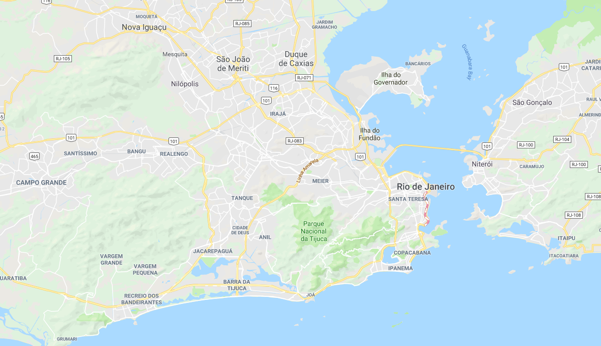
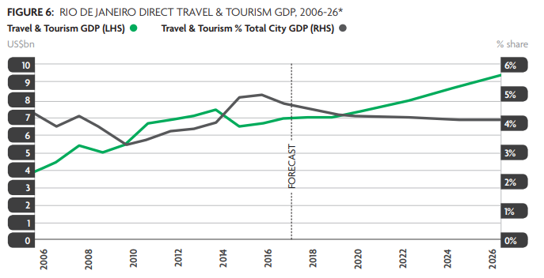
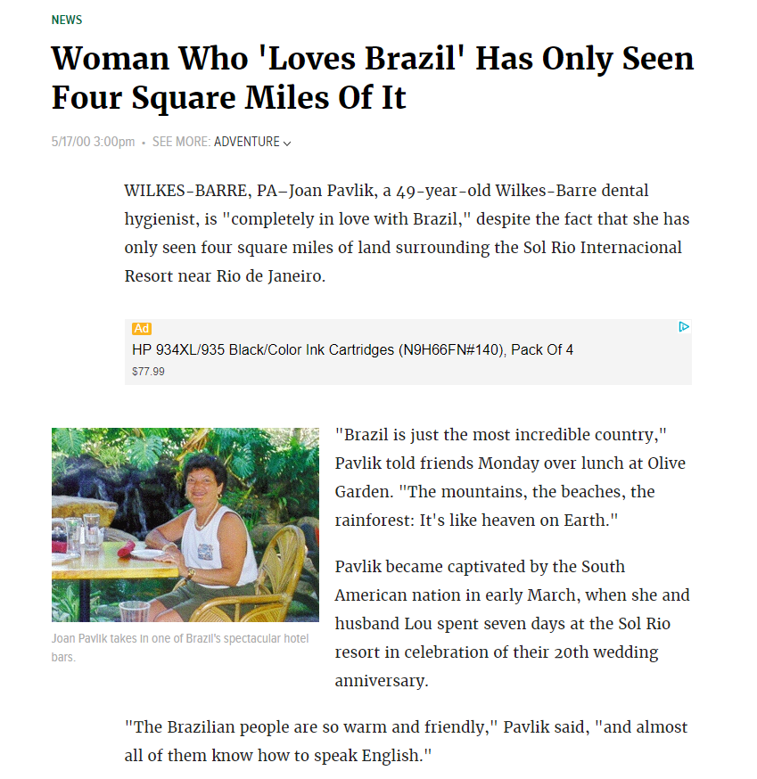
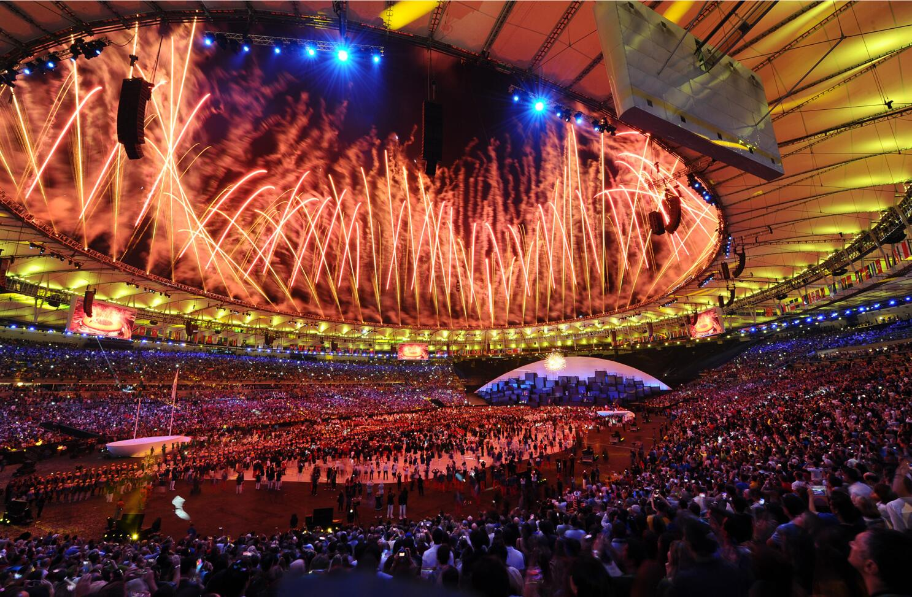

```{r setup, include=FALSE}
options(htmltools.dir.version = FALSE)
```

## Key themes

* Tourism as urban economic strategy

* Mega-events and urban development

* Brazilian _favelas_

---

## Rio de Janeiro


.footnote[Source: [The Telegraph](https://www.telegraph.co.uk/travel/destinations/south-america/brazil/rio-de-janeiro/)]

---

## Rio de Janeiro



---

## Rio de Janeiro


.footnote[Source: [Wikimedia Commons](https://upload.wikimedia.org/wikipedia/commons/8/86/Nicolas-Antoine_Taunay.jpg)]

---

## Tourism and Rio de Janeiro


.footnote[Source: [The Travel Channel](https://www.travelchannel.com/interests/beaches/articles/ipanema-beach-brazil)]

---

## Tourism and Rio de Janeiro


.footnote[Source: The Travel Channel]

---

## Tourism and Rio de Janeiro



.footnote[Source: [World Travel & Tourism Council](https://www.wttc.org/-/media/files/reports/economic-impact-research/cities-2017---regional/latin-america-city-travel-and-tourism-impact-2017.pdf?la=en)]

---

## Tourism and Rio de Janeiro



.footnote[Source: [_The Onion_](https://www.theonion.com/woman-who-loves-brazil-has-only-seen-four-square-miles-1819565601)]

---

## The 2014 World Cup


.footnote[[Image source](https://www.sportskeeda.com/football/2014-fifa-world-cup-equals-record-most-goals-scored-tournament-history)]

---

## The 2016 Summer Olympics



.footnote[Source: Los Angeles Times]

---
class: middle, center, inverse

## Hosting mega-events: costs and benefits

---

## The cost of the Olympics

* [Video: Are Olympics worth the cost?  CBS News](https://www.cbsnews.com/video/are-costs-of-the-olympics-worth-it-for-host-cities/)

---

## Olympic infrastructure 


.footnote[Source: Railway Gazette]

---

## Olympic infrastructure

<iframe width="750" height="500" src="https://www.youtube.com/embed/YHguBnA4UM4?rel=0" frameborder="0" allow="autoplay; encrypted-media" allowfullscreen></iframe>

---

## Race in Brazil


---

## Inequality in Rio de Janeiro


<!-- Have a look at Rio in Google Maps; show street view.  Compare area around Ipanema/Copacabana with Rocinha favela; look at Street View, Earth View -->

---

## The Olympics and the _favelas_

<iframe width='750' height='500' scrolling='no' src='https://www.washingtonpost.com/video/c/embed/dabedf24-584a-11e6-8b48-0cb344221131' frameborder='0' webkitallowfullscreen mozallowfullscreen allowfullscreen></iframe>

---

## _Favela_ tourism


.footnote[[Image source](http://lifeinrocinha.blogspot.com/2015/06/how-favela-tourism-can-benefit-community.html)]

---


class: middle, center, inverse

# Next up: Paris & Berlin


<style>

h1, h2, h3 {
  color: #386890; 
}

a {
  color: #90b4d2; 
}

.inverse {
  background-color: #386890; 

}
</style>


