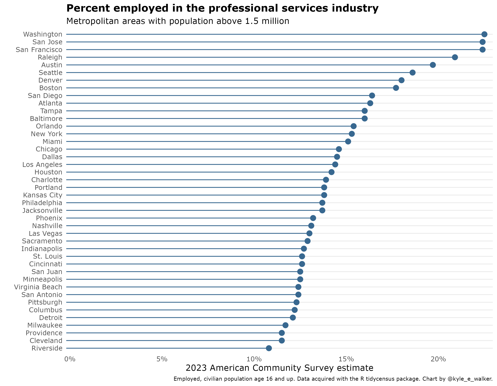
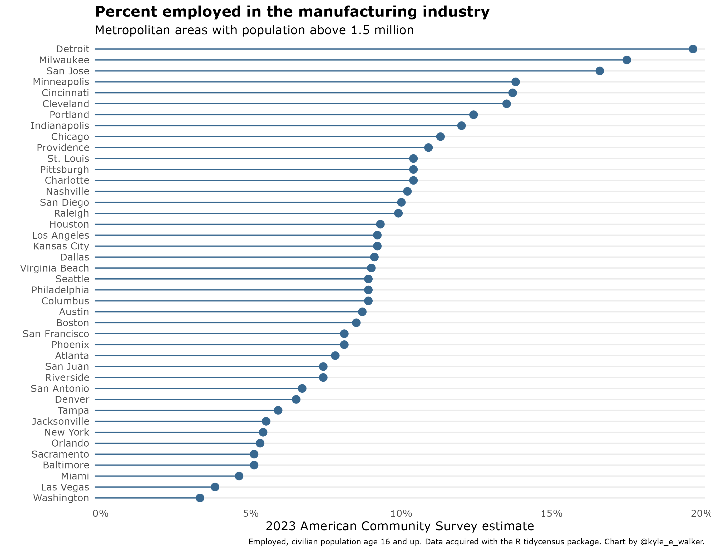
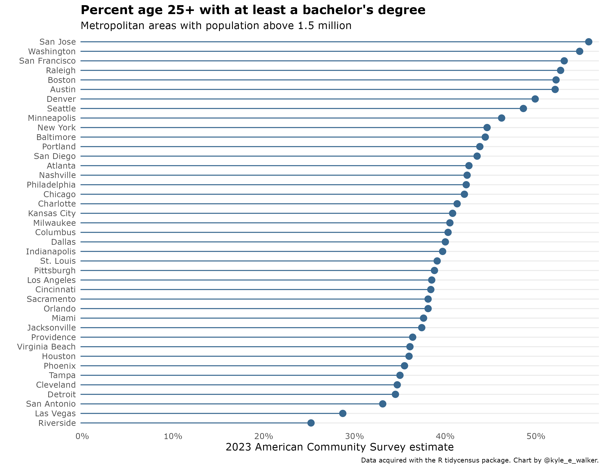
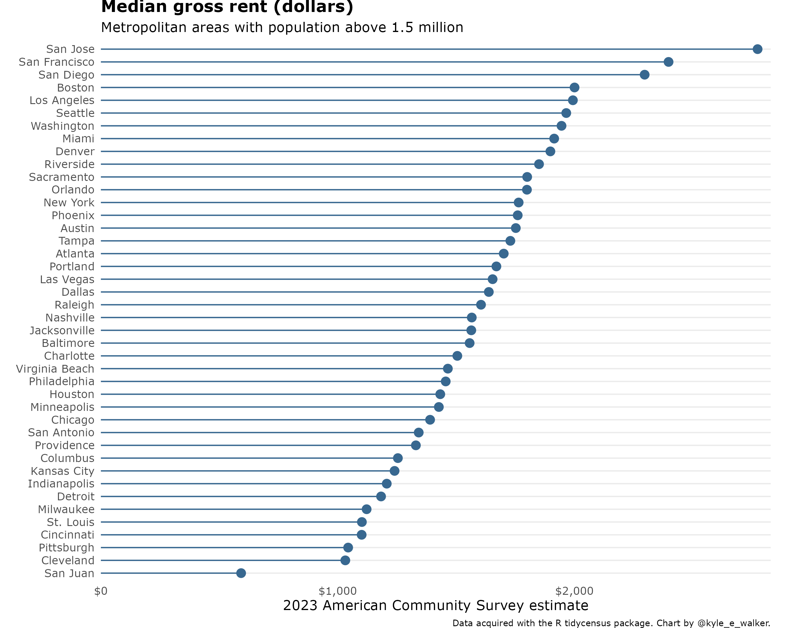

```{r setup, include=FALSE}
options(htmltools.dir.version = FALSE)
```

## This week's key themes

* Labor markets

* Economic clustering

* The "creative class"

* The "great divergence"

---

## The San Francisco Bay Area


---

## San Francisco


.footnote[Source: Wikimedia Commons]

---

## The East Bay


.footnote[Source: East Bay Times]

---

## Silicon Valley


.footnote[Source: _The Wall Street Journal_]

---
class: middle, center, inverse

## Labor markets

---

## Information services industry


---

## Professional services industry



---

## Manufacturing industry 



---
class: middle, center, inverse

## Why do industries cluster? 

---

## Agglomeration economies


.footnote[Source: [_The Geography of Transport Systems_](https://transportgeography.org/?page_id=1559)]

---

## Agglomeration economies

* Economies of _scale_

* Economies of _density_

---

## Clustering in the Bay Area


.footnote[Source: HBO/Business Insider]

---

## The "creative class"


.footnote[Source: Miami Agent Magazine/stock photo]

---

## The "creative class"

<iframe width="750" height="500" src="https://www.youtube.com/embed/FctgkylRF9M" frameborder="0" allow="autoplay; encrypted-media" allowfullscreen></iframe>

---

## The "creative class"

### Characteristics: 

---

## Clustering, labor markets, and spillovers

---

class: middle, center, inverse

## The "great divergence"

---

## Divergence between metros



---

## Divergence within metros

[Educational Attainment in America](http://personal.tcu.edu/kylewalker/maps/education/#9.29/37.8084/-122.3895)


---
class: middle, center, inverse

## Real estate

---

## Real estate



---

## Real estate


---

## Real estate in the Bay Area

<iframe src="value.html" height = "475" width = "800" scrolling="no" frameborder = "0"></iframe>

---

## Real estate in the Bay Area

<iframe scrolling="no" frameborder="0" allowfullscreen webkitallowfullscreen mozallowfullscreen src="https://w3.cdn.anvato.net/player/prod/v3/anvload.html?key=eyJtIjoiZXBmb3giLCJwIjoiZGVmYXVsdCIsInYiOiIzOTQ2NTYiLCJhbnZhY2siOiJhbnZhdG9fZXBmb3hfYXBwX3dlYl9wcm9kX2IzMzczMTY4ZTEyZjQyM2Y0MTUwNGYyMDcwMDAxODhkYWY4ODI1MWIiLCJwbHVnaW5zIjp7ImRmcCI6eyJjbGllbnRTaWRlIjp7ImFkVGFnVXJsIjoiaHR0cHM6Ly9wdWJhZHMuZy5kb3VibGVjbGljay5uZXQvZ2FtcGFkL2Fkcz9zej02NDB4NDgwJml1PS82Mzc5MDU2NC9rdHZ1L25ld3MmY2l1X3N6cz0zMDB4MjUwJmltcGw9cyZnZGZwX3JlcT0xJmVudj12cCZvdXRwdXQ9dmFzdCZ2cG9zPXByZXJvbGwmdW52aWV3ZWRfcG9zaXRpb25fc3RhcnQ9MSZ1cmw9W3JlZmVycmVyX3VybF0mY29ycmVsYXRvcj1bdGltZXN0YW1wXSZkZXNjcmlwdGlvbl91cmw9aHR0cCUzQSUyRiUyRnd3dy5rdHZ1LmNvbSUyRm5ld3MlMkZ0aGUtYnJlYWR0aC1hbmQtZGVwdGgtb2YtdGhlLWJheS1hcmVhLWhvdXNpbmctY3Jpc2lzIn19LCJyZWFsVGltZUFuYWx5dGljcyI6dHJ1ZX0sImh0bWw1Ijp0cnVlfQ%3D%3D"  width ="640" height="360"></iframe>

---

## NIMBY-ism


.footnote[Source: https://tallbloke.wordpress.com]

---

## Evictions in San Francisco

* [Ellis Act evictions - Anti-Eviction Mapping Project](http://www.antievictionmappingproject.net/ellis.html)

* [All Bay Area evictions](https://www.antievictionmap.com/evictions)

---

## Where do people go?

* [Mapping Relocation - AEMP](https://antievictionmapd.maps.arcgis.com/apps/MapJournal/index.html?appid=e9d1638ec7724e899325e88ad62d4089)


---
class: middle, center, inverse

# Next up: Houston


<style>

h1, h2, h3 {
  color: #386890; 
}

a {
  color: #90b4d2; 
}

.inverse {
  background-color: #386890; 

}
</style>


